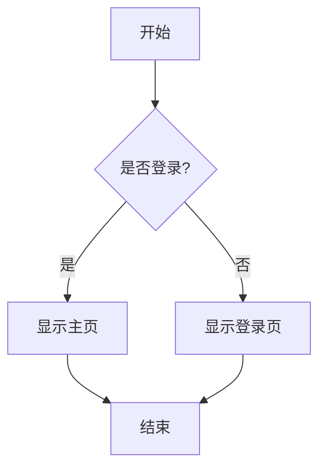
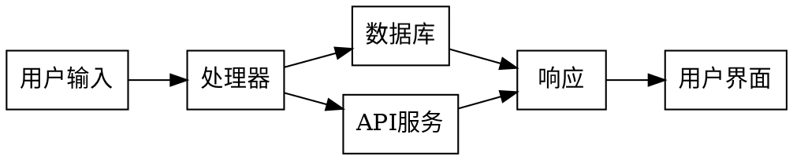

# 新功能测试指南

## 1. 快捷命令测试

在聊天输入框中输入 `/` 开头的命令来测试：

- `/help` - 显示帮助信息
- `/model gpt` - 切换模型
- `/clear` - 清空对话
- `/new` - 新建对话

## 2. Mermaid 图表自动渲染测试

在聊天中发送以下代码块：

## 3. Graphviz 图表自动渲染测试

在聊天中发送以下代码块：

## 4. 图表交互功能测试

- 点击图表查看大图
- 使用缩放功能
- 下载PNG格式图片
- 对于Graphviz，测试LR/TB布局切换

## 5. 回滚测试

如果功能出现问题，可以从 `backup_before_features/` 目录恢复文件。

## 测试步骤

1. 打开 http://localhost:5176
2. 测试每个功能模块
3. 检查控制台是否有错误
4. 验证图表渲染和交互
5. 确认快捷命令工作正常
